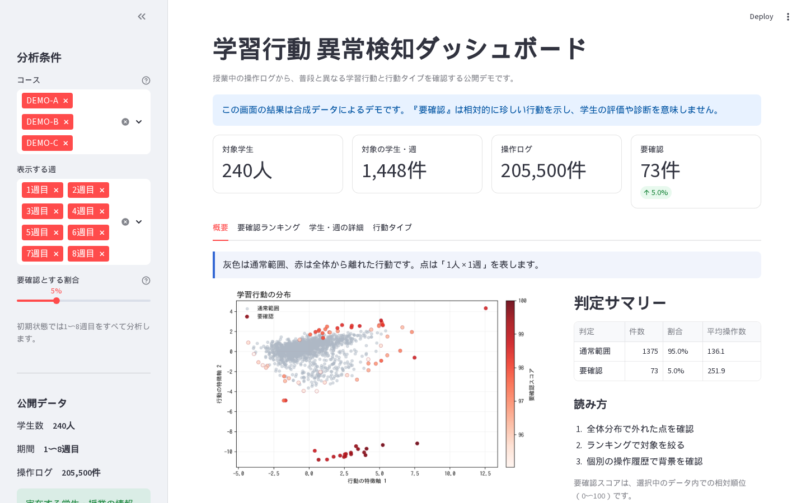

# 学習行動 異常検知ダッシュボード — 公開デモ

授業中の教材操作ログから、全体と異なる学習行動や、似た行動タイプを確認するStreamlitアプリです。

この公開版は、完全な合成データだけを使用します。実在する学生、授業、教材、操作履歴、研究用モデルは含みません。

> [!IMPORTANT]
> 「要確認」は、選択したデータ内で相対的に珍しい行動を示します。学生の評価、診断、不正判定を行うものではありません。

## デモ

[実際の公開UIを操作したデモ動画を見る](demo/public_dashboard_demo.mp4)



動画は `web_public.py` をブラウザで実際に開き、各タブを操作して収録しています。画面を描き直したモック動画ではありません。

## 主な機能

- 1〜8週目を初期選択し、コース・週で分析範囲を変更
- 「学生 × 週」を1件として、相対的に珍しい行動を抽出
- 要確認スコアとランキングの表示・CSVダウンロード
- 学生・週ごとの操作カテゴリと時系列ログの確認
- 似た学習行動を行動タイプとして可視化
- 合成データであることと、スコアの注意事項を画面内に常時表示

## 公開データ

| 項目 | 内容 |
|---|---:|
| 架空の学生 | 240人 |
| 架空のコース | 3コース |
| 対象期間 | 1〜8週目 |
| 学生・週 | 1,448件 |
| 操作ログ | 205,500件 |

`public_data/learning_events.csv.gz` は公開デモ用のデータセットです。

列の意味は [public_data/README.md](public_data/README.md) を参照してください。

## 分析方法

公開版では、各学生・週について次の特徴を集計します。

- 操作数、操作種類数、活動時間、閲覧ページ数
- ページ移動率、戻る操作率
- マーカー・メモなどの書き込み率
- 理解度操作率、検索・ジャンプ率

特徴量を標準化した後、以下を使用しています。

- **Isolation Forest**: 全体から離れた行動の抽出
- **PCA**: 2次元の分布表示
- **K-Means**: 行動タイプのグループ化

要確認スコアは選択範囲内の相対順位を0〜100で表したもので、異常の確率ではありません。

## 必要環境

- Python 3.10以上
- pip

## 起動方法

```bash
python3 -m pip install -r requirements.txt
streamlit run web_public.py
```

ブラウザで表示されたURLを開きます。公開用データはリポジトリに含まれています。

## 画面の見方

1. サイドバーでコース、週、要確認とする割合を指定します。
2. **概要**で全体分布と週ごとのデータ量を確認します。
3. **要確認ランキング**で確認対象を絞ります。
4. **学生・週の詳細**で操作内訳と時系列を確認します。
5. **行動タイプ**で似た学習行動のまとまりを比較します。

## デモ動画の再作成

動画生成スクリプトは、実際のStreamlit UIをPlaywrightで操作・録画します。

```bash
python3 -m pip install -r requirements-video.txt
python3 -m playwright install chromium
python3 scripts/create_demo_video.py
```

生成物:

- `demo/public_dashboard_demo.mp4`
- `docs/public-dashboard-overview.png`

## GitHub / Streamlit Community Cloud への公開

このフォルダの内容だけで、公開用リポジトリを作成できます。研究用データ、モデル、ノートブックは含まれていません。

Streamlit Community Cloudでは、GitHubリポジトリを接続して次の設定を指定します。

- **Main file path**: `web_public.py`
- **Python version**: 3.10以上
- **Dependencies file**: `requirements.txt`

リポジトリに含まれる合成データだけで起動できます。認証情報や実データを追加する場合は、`.streamlit/secrets.toml`をコミットしないでください。

## 研究用版との違い

| 項目 | 公開版 | 研究用版 |
|---|---|---|
| データ | 完全な合成データ | 研究用データ |
| 分析単位 | 学生 × 週 | 複数モード |
| 異常検知 | 軽量な行動特徴量 + Isolation Forest | BERT埋め込み + Isolation Forest |
| 依存関係 | Streamlit、pandas、scikit-learn中心 | OpenLA、PyTorchなどを含む |
| UI | 4タブに整理 | 詳細な研究分析向け |

## 制約

- 合成データの結果は、実運用上の性能を示すベンチマークではありません。
- スコアは選択中のコース・週・閾値によって変化します。
- 行動タイプの番号に、優劣や成績順の意味はありません。
- 実データへ置き換える場合は、利用目的、同意、匿名化、アクセス制御を別途設計してください。

## ファイル構成

```text
web_public.py                         # 公開用Streamlitアプリ
requirements.txt                     # アプリ実行用依存関係
requirements-video.txt               # 動画作成用依存関係
.streamlit/
  config.toml                        # 公開画面のテーマ設定
.gitignore                           # 秘密情報・キャッシュの除外
.gitattributes                       # 動画・画像・圧縮データをバイナリとして扱う設定
public_data/
  learning_events.csv.gz             # 合成イベントログ
  README.md                           # データ列の説明
scripts/
  create_demo_video.py                # 実UIの録画
demo/
  public_dashboard_demo.mp4           # 公開デモ動画
docs/
  public-dashboard-overview.png       # README用スクリーンショット
```

